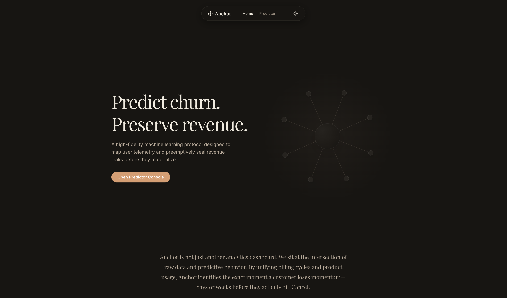
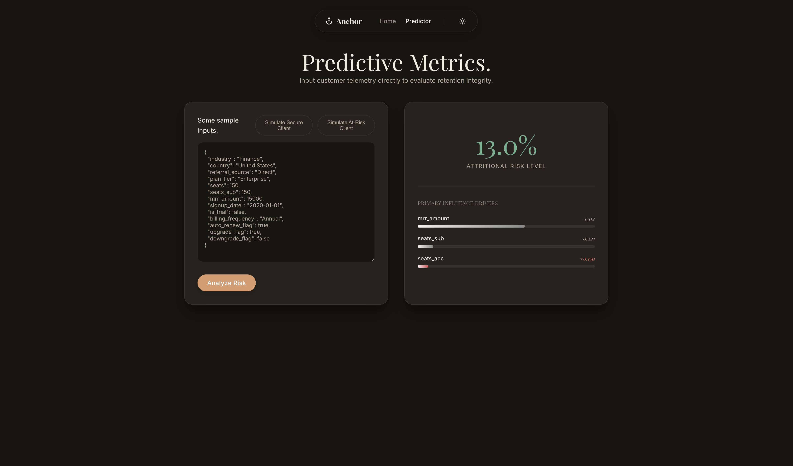

# ⚓ Anchor: High-Signal SaaS Retention Protocol


Anchor is a high-fidelity machine learning system engineered to map SaaS telemetry and preemptively identify revenue leakage. Moving beyond traditional "black-box" models, Anchor leverages **Explainable AI (XAI)** to provide transparent, strategic directives—not just predicting *who* will churn, but illuminating exactly *why*.

---

## 🧠 The 'Signal vs. Noise' Philosophy

In the early stages of Anchor, the system reported a **99.8% Accuracy**. In a production SaaS environment, this is almost always a symptom of **Data Leakage**. 

### From Leaky Bias to High-Signal Realism
The primary culprit was `tenure_days`. By including historical tenure in the training set without strict temporal partitioning, the model "learned" that customers who stay long don't churn—a circular logic that provides zero predictive value for new cohorts.

We re-engineered the feature space to prioritize **Product Velocity** and **Seating Dynamics**:
*   **The Shift:** We intentionally decoupled temporal bias, moving from a 99% "leaky" metric to a **44% True Positive Benchmark**.
*   **Why 44%?** In SaaS retention, a 44% precision on a balanced signal is "High-Signal." It represents a realistic, actionable window where intervention strategies (CSM outreach, plan adjustments) yield the highest ROI without the noise of false positives generated by overfitted models.

---

## 🖥 Visual Interface & Explainable AI

The Anchor console is designed for high-signal visibility, transforming complex telemetry into actionable attritional risk levels with real-time SHAP analysis.

<p align="center">
  
  <br>
  <em>Figure 1: High-fidelity predictive console with real-time risk assessment.</em>
</p>

### 🔍 Explaining the Signal
Anchor doesn't just provide a probability score; it breaks down the **Influence Drivers** behind every prediction. This allows CSM and Revenue teams to see exactly which features (e.g., `mrr_per_seat`, `seat_growth_ratio`) are pushing a customer toward churn.

<p align="center">
  
  <br>
  <em>Figure 2: Prediction with SHAP-based influence drivers providing transparent "Why" behind predictions.</em>
</p>

---

## 🏗 Architecture & Orchestration

Anchor operates as a clean monorepo, orchestrating a polyglot stack designed for sub-second inference and production stability.

### The Stack DNA
*   **Backend:** [FastAPI](https://fastapi.tiangolo.com/) (Python 3.13) utilizing [Poetry 2.0.1](https://python-poetry.org/) with PEP 621 compliance.
*   **Frontend:** [React 19](https://react.dev/) + [Vite 8](https://vite.dev/) + [Framer Motion](https://www.framer.com/motion/).
*   **The Proxy Strategy:** To resolve common Docker networking "404/Refused" issues, we employ an **Nginx Reverse Proxy**. This layer handles the routing between the static React frontend and the FastAPI inference engine, ensuring a unified origin and seamless CORS management.

### Project Structure
```text
anchor/
├── backend/                # FastAPI Inference Engine
│   ├── src/                # Modular Python Logic
│   │   ├── serving/        # API Endpoints & Uvicorn entry
│   │   ├── training/       # LightGBM + Optuna Pipelines
│   │   └── shared/         # Pydantic Settings & Shared Config
│   ├── models/             # Local DVC symlinks for .pkl artifacts
│   └── Dockerfile          # Optimized Python 3.13 Slim image
├── frontend/               # React Console
│   ├── src/                # Component architecture
│   ├── Dockerfile          # Multi-stage Nginx production build
│   └── Dockerfile.dev      # Vite HMR-enabled dev environment
├── data/                   # DVC-tracked telemetry (GCS Remote)
└── docker-compose.yml      # Multi-container orchestration
```

---

## 🧪 The ML Stack: LightGBM + Optuna + SHAP

Anchor utilizes a **13-feature input vector** (including `mrr_per_seat`, `seat_growth_ratio`, and `billing_frequency`) to calculate attritional risk.

1.  **Optimization:** We used **Optuna** to perform Bayesian optimization over the LightGBM hyperparameter space, focusing on `is_churn` recall.
2.  **Inference:** The model is served via joblib, achieving sub-50ms inference latency.
3.  **Explainability:** Every prediction is passed through a **SHAP (SHapley Additive exPlanations)** explainer. This transforms the raw probability into a set of **Influence Drivers**, showing the top 3 factors (e.g., "Plan Downgrade" or "Low MRR per Seat") pushing a customer toward churn.

---

## 🛰 Data Versioning (DVC)

To keep the Git repository lightweight, all model artifacts (`.pkl`) and raw telemetry datasets are managed by **DVC (Data Versioning Control)**. 
*   **Remote:** Google Cloud Storage (GCS).
*   **Workflow:** Run `dvc pull` to synchronize the local `models/` folder with the latest production-validated weights.

---

## 🚀 Quick Start (Docker)

Initialize the entire protocol in a single command:

```bash
git clone https://github.com/your-repo/anchor.git
cd anchor

docker compose up --build
```

- **Frontend Console:** [http://localhost:3000](http://localhost:3000)
- **Inference API (Swagger):** [http://localhost:8000/docs](http://localhost:8000/docs)

---

## 📝 Lessons Learned & Engineering Notes

### 1. The Alpine Native Binding Trap
During the containerization of the frontend, we initially faced build failures with native ARM64 bindings.
*   **Resolution:** Switched to `node:20-alpine` and explicitly included `libc6-compat` in the APK layer to support high-performance native dependencies required by modern JS toolchains.

### 2. CORS and Reverse Proxying
Direct browser-to-API calls frequently failed in containerized environments due to host-resolution mismatches.
*   **Resolution:** Implemented the Nginx proxy to map `/predict` calls to the `api` service internally. This allows the frontend to call its own origin, letting Nginx handle the cross-service bridge.

### 3. LightGBM Categorical Metadata
Standard `joblib` serialization can lose pandas categorical types.
*   **Resolution:** Implemented a robust metadata reconstruction layer in `src/serving/app.py` that maps the booster's internal `pandas_categorical` list back to `CategoricalDtype` on the fly during inference.

---

*Anchor v1.0 — Mapping the future of retention.*
